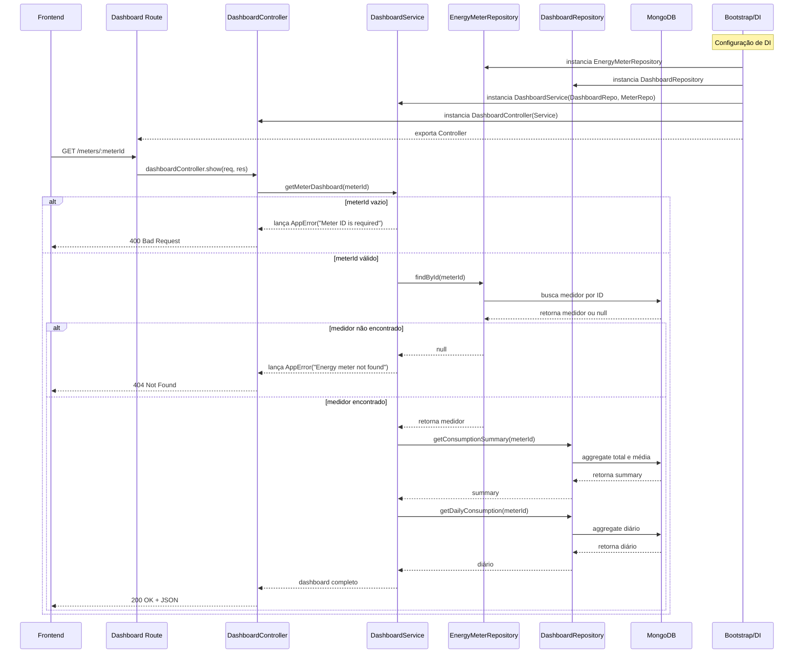

# 5.1.2 Diagramas de Sequências

```mermaid
sequenceDiagram
    participant Frontend
    participant Route as Dashboard Route
    participant Controller as DashboardController
    participant Service as DashboardService
    participant MeterRepo as EnergyMeterRepository
    participant DashboardRepo as DashboardRepository
    participant DB as MongoDB
    participant Config as Bootstrap/DI

    Note over Config: Configuração de DI
    Config->>MeterRepo: instancia EnergyMeterRepository
    Config->>DashboardRepo: instancia DashboardRepository
    Config->>Service: instancia DashboardService(DashboardRepo, MeterRepo)
    Config->>Controller: instancia DashboardController(Service)
    Config-->>Route: exporta Controller

    Frontend->>Route: GET /meters/:meterId
    Route->>Controller: dashboardController.show(req, res)
    Controller->>Service: getMeterDashboard(meterId)
    alt meterId vazio
        Service-->>Controller: lança AppError("Meter ID is required")
        Controller-->>Frontend: 400 Bad Request
    else meterId válido
        Service->>MeterRepo: findById(meterId)
        MeterRepo->>DB: busca medidor por ID
        DB-->>MeterRepo: retorna medidor ou null
        alt medidor não encontrado
            MeterRepo-->>Service: null
            Service-->>Controller: lança AppError("Energy meter not found")
            Controller-->>Frontend: 404 Not Found
        else medidor encontrado
            MeterRepo-->>Service: retorna medidor
            Service->>DashboardRepo: getConsumptionSummary(meterId)
            DashboardRepo->>DB: aggregate total e média
            DB-->>DashboardRepo: retorna summary
            DashboardRepo-->>Service: summary
            Service->>DashboardRepo: getDailyConsumption(meterId)
            DashboardRepo->>DB: aggregate diário
            DB-->>DashboardRepo: retorna diário
            DashboardRepo-->>Service: diário
            Service-->>Controller: dashboard completo
            Controller-->>Frontend: 200 OK + JSON
        end
    end

```