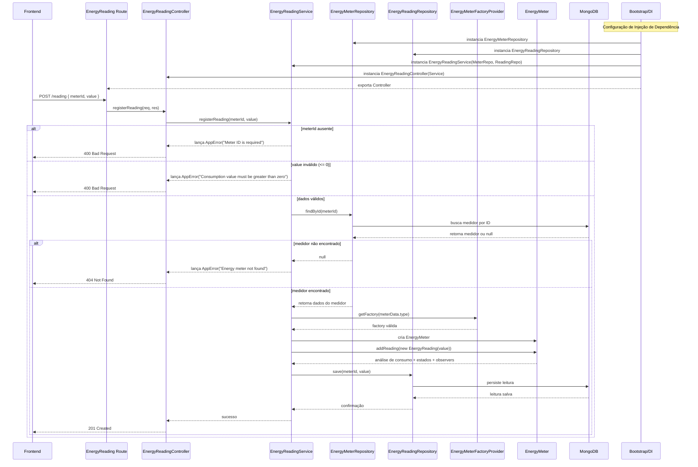

# 5.3.2. Diagrama de Sequência – Registro de Leitura (`POST /reading`)

```mermaid
sequenceDiagram
    participant Frontend
    participant Route as EnergyReading Route
    participant Controller as EnergyReadingController
    participant Service as EnergyReadingService
    participant MeterRepo as EnergyMeterRepository
    participant ReadingRepo as EnergyReadingRepository
    participant Factory as EnergyMeterFactoryProvider
    participant Domain as EnergyMeter
    participant DB as MongoDB
    participant Config as Bootstrap/DI

    Note over Config: Configuração de Injeção de Dependência
    Config->>MeterRepo: instancia EnergyMeterRepository
    Config->>ReadingRepo: instancia EnergyReadingRepository
    Config->>Service: instancia EnergyReadingService(MeterRepo, ReadingRepo)
    Config->>Controller: instancia EnergyReadingController(Service)
    Config-->>Route: exporta Controller

    Frontend->>Route: POST /reading { meterId, value }
    Route->>Controller: registerReading(req, res)
    Controller->>Service: registerReading(meterId, value)

    alt meterId ausente
        Service-->>Controller: lança AppError("Meter ID is required")
        Controller-->>Frontend: 400 Bad Request
    else value inválido (<= 0)
        Service-->>Controller: lança AppError("Consumption value must be greater than zero")
        Controller-->>Frontend: 400 Bad Request
    else dados válidos
        Service->>MeterRepo: findById(meterId)
        MeterRepo->>DB: busca medidor por ID
        DB-->>MeterRepo: retorna medidor ou null

        alt medidor não encontrado
            MeterRepo-->>Service: null
            Service-->>Controller: lança AppError("Energy meter not found")
            Controller-->>Frontend: 404 Not Found
        else medidor encontrado
            MeterRepo-->>Service: retorna dados do medidor
            Service->>Factory: getFactory(meterData.type)
            Factory-->>Service: factory válida
            Service->>Domain: cria EnergyMeter
            Service->>Domain: addReading(new EnergyReading(value))
            Domain-->>Service: análise de consumo + estados + observers
            Service->>ReadingRepo: save(meterId, value)
            ReadingRepo->>DB: persiste leitura
            DB-->>ReadingRepo: leitura salva
            ReadingRepo-->>Service: confirmação
            Service-->>Controller: sucesso
            Controller-->>Frontend: 201 Created
        end
    end
```