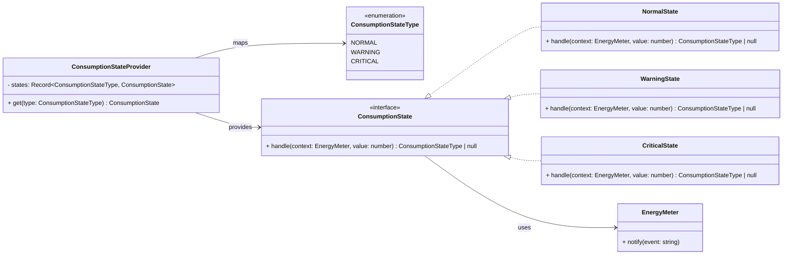
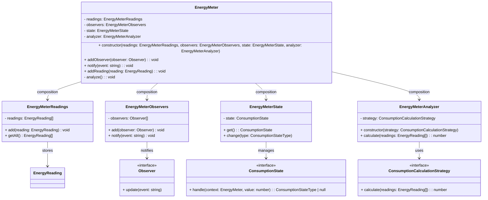

# Projeto Sistema de Monitoramento de Consumo de Energia

**Autor:** Rubens Rabêlo Soares

[Repositório no Github](https://github.com/rubensrabelo/gestao-de-consumo-de-energia)

## 1. Introdução

O crescente interesse por soluções que promovam o uso consciente de recursos energéticos tem impulsionado o desenvolvimento de sistemas voltados ao monitoramento e análise do consumo de energia elétrica. Nesse contexto, este projeto propõe o desenvolvimento de um sistema simples capaz de realizar o cadastro de medidores, o registro de leituras diárias e a apresentação das informações por meio de dashboards, possibilitando uma análise clara e objetiva dos dados de consumo.

A solução foi implementada utilizando React com TypeScript no desenvolvimento do front-end, Node.js com TypeScript com Express na construção da API RESTful e MongoDB como banco de dados, buscando uma arquitetura organizada, extensível e alinhada aos princípios e padrões de projeto adotados ao longo do desenvolvimento.

---

## 2. Arquitetura do Projeto

A arquitetura do sistema é dividida em três camadas principais:

### 2.1 Front-end
- Implementado em React + TypeScript
- Componentização de telas, cards e gráficos
- Uso do Recharts para visualização de consumo
- Modais para registro de leituras
- Router com `react-router-dom` para navegação entre telas

#### 2.1.1. Estrutura das pastas

```ts
frontend/
├─ src/
│  ├─ api/
│  │  └─ services/
│  │     ├─ base/
│  │     ├─ meter/
│  │     └─ dashboard/
│  │
│  ├─ components/      // UI reutilizável global (ex.: Header, NotificationToast)
│  │  ├─ Header/
│  │  ├─ Notification/
│  │  └─ ...
│  │
│  ├─ pages/           // Cada página encapsula seus próprios components e hooks
│  │  ├─ Home/
│  │  │  ├─ components/
│  │  │  └─ hooks/
│  │  │
│  │  └─ Dashboard/
│  │     ├─ components/
│  │     └─ hooks/
│  │
│  ├─ config/          // Configurações gerais, captura do .env
│  ├─ context/         // Ex.: NotificationContext
│  ├─ layouts/         // Layouts gerais (ex.: PublicLayout)
│  ├─ router/          // Registro das rotas do frontend
│  │
│  ├─ types/           // Tipagem TypeScript para dados do sistema
│  │  ├─ domain/
│  │  ├─ dashboard/
│  │  └─ enums/
│  │
│  ├─ App.tsx
│  ├─ App.module.css
│  └─ main.tsx
├─ index.html
├─ .env
├─ .env.example
├─ package.json
└─ tsconfig.json
```

#### 2.1.2. Observações:

* `api/services` → todas as chamadas HTTP ao backend.
* `config` → captura variáveis do `.env` e configurações gerais.
* `components` → UI reutilizável global, como Header e notificações.
* `pages/*/components` → components específicos daquela página.
* `pages/*/hooks` → hooks específicos daquela página, sem poluir hooks globais.
* `context` → contexto global, como socket para notificações.
* `layouts` → componentes de layout, ex.: `PublicLayout`.
* `router` → registro e gerenciamento das rotas do frontend.
* `types` → tipagem TypeScript para todos os dados do sistema.


### 2.2 Back-end
- Implementado em Node.js + TypeScript
- Padrão de arquitetura Repository-Service-Controller
- Comunicação com MongoDB usando Mongoose
- Tratamento de erros centralizado
- Validação de dados de consumo e medidores

## 2.2.1. Estrutura das pastas:

```ts
backend/
├─ src/
│  ├─ api/
│  │  ├─ controllers/      // Recebem requisições HTTP, chamam os services
│  │  └─ routes/           // Definição das rotas da API
│  │
│  ├─ application/         
│  │  └─ services/         // Lógica de negócio, interage com domain e repositories
│  │
│  ├─ domain/
│  │  ├─ entities/         // Modelos de negócio (ex.: EnergyMeter, EnergyReading)
│  │  ├─ factories/        // Padrão Factory para criação de objetos complexos
│  │  ├─ observers/        // Implementação de observers (notificações, logs, etc.)
│  │  ├─ states/           // States ou status específicos de entidades
│  │  └─ strategies/       // Estratégias e regras de negócio variantes
│  │
│  ├─ infra/
│  │  ├─ repositories/     // Acesso ao banco (MongoDB)
│  │  │  └─ models/        // Modelos referentes ao Mongo
│  │  ├─ database/         // Conexão e setup do MongoDB
│  │  └─ socket/           // Socket.IO para notificações em tempo real
│  │
│  ├─ shared/
│  │  └─ errors/           // Erros customizados para API (AppError)
│  │
│  ├─ config/              // Containers para injeção de dependências
│  │
│  ├─ app.ts               // Configuração do Express
│  └─ server.ts            // Inicialização do servidor + Socket.IO
├─ .env
├─ Dockerfile
├─ docker-compose.yml
├─ package.json
└─ tsconfig.json

```

#### 2.2.2. Observações:

* `api/controllers` → recebem requisições, chamam os services e retornam respostas HTTP.
* `application/services` → lógica de negócio, integra domain e infra.
* `infra/repositories` → abstração do banco de dados, separando persistência da lógica.
* `infra/database` → inicialização e conexão com MongoDB.
* `infra/socket` → gerenciamento de sockets para notificações em tempo real.
* `domain/entities` → entidades do sistema, contendo estado e regras básicas.
* `domain/factories` → padrão Factory para criar entidades complexas.
* `domain/observers` → implementação do padrão Observer, usado para logs e notificações.
* `domain/states` → estados ou status possíveis para as entidades.
* `domain/strategies` → implementação do padrão Strategy para regras variantes.
* `shared/errors` → erros customizados (ex.: `AppError`) para padronizar respostas da API.
* `config` → containers para injeção de dependências.
* `app.ts` → configuração do Express e middlewares.
* `server.ts` → inicialização do HTTP server + integração com Socket.IO.

### 2.3 Banco de Dados
- MongoDB com coleções:
  - `energyMeters` → cadastro de medidores
  - `energyReadings` → registros de consumo
- Utilização de ObjectId para referência de medidores
- Agregações para cálculo de consumo total, médio e diário


### 2.4. Diagrama de Arquitetura e Comunicação com o Backend


### 2.5 Fluxo de Dados
1. Usuário insere o tipo de medidor Residêncial ou Escolar
2. Usuário acessa o dashboard de um medidor específico
3. Usuário insere o valor do consumo de energia
4. Front-end requisita dados via API
5. Back-end busca informações no MongoDB
6. API retorna dados consolidados (total, média, diário)
7. Front-end renderiza gráficos e cards

---

## 3. Aplicação da Injeção de Dependência (Backend)

No backend do sistema, a **injeção de dependência (Dependency Injection – DI)** foi utilizada para manter o código modular, desacoplado e mais fácil de testar. Essa abordagem permite que classes de alto nível (como **controllers** e **services**) dependam de abstrações ou instâncias concretas fornecidas externamente, em vez de criarem suas próprias dependências internamente.

### 3.1. Controllers e Services

As controllers no sistema não possuem lógica de negócio própria. Elas recebem via construtor instâncias de **services**, que por sua vez recebem suas dependências de **repositories**.

Exemplo do Dashboard:

```ts
// config/bootstrapDashboard.ts
import { DashboardRepository } from "../infra/repositories/DashboardRepository";
import { EnergyMeterRepository } from "../infra/repositories/EnergyMeterRepository";
import { DashboardService } from "../application/services/DashboardService";
import { DashboardController } from "../api/controllers/DashboardController";

// Instancia os repositórios
const dashboardRepository = new DashboardRepository();
const meterRepository = new EnergyMeterRepository();

// Injeta os repositórios no serviço
const dashboardService = new DashboardService(dashboardRepository, meterRepository);

// Injeta o serviço na controller
export const dashboardController = new DashboardController(dashboardService);
```

* `DashboardController` não precisa criar ou conhecer a implementação dos repositórios.
* `DashboardService` recebe os repositórios via construtor, mantendo o acoplamento baixo.
* Qualquer mudança na implementação dos repositórios (ex.: trocar MongoDB por PostgreSQL) não afeta os controllers.

### 3.2. Outros serviços do backend

O mesmo padrão é aplicado para medidores e leituras de energia:

```ts
// config/bootstrapEnergy.ts
import { EnergyMeterService } from "../application/services/EnergyMeterService";
import { EnergyReadingService } from "../application/services/EnergyReadingService";
import { EnergyMeterRepository } from "../infra/repositories/EnergyMeterRepository";
import { EnergyReadingRepository } from "../infra/repositories/EnergyReadingRepository";
import { EnergyMeterController } from "../api/controllers/EnergyMeterController";
import { EnergyReadingController } from "../api/controllers/EnergyReadingController";

// Repositórios
const meterRepository = new EnergyMeterRepository();
const readingRepository = new EnergyReadingRepository();

// Services com injeção de dependência
const meterService = new EnergyMeterService(meterRepository);
const readingService = new EnergyReadingService(meterRepository, readingRepository);

// Controllers recebem os services via construtor
export const energyMeterController = new EnergyMeterController(meterService);
export const energyReadingController = new EnergyReadingController(readingService);
```

### 3.3. Benefícios da abordagem

1. **Desacoplamento**: Classes de alto nível não criam suas dependências diretamente, reduzindo o acoplamento entre camadas.
2. **Substituição fácil**: Implementações concretas podem ser substituídas sem alterar os controllers ou serviços. Ex.: trocar `EnergyMeterRepository` por outro tipo de persistência.
3. **Coerência e manutenção**: Toda a configuração das dependências é centralizada na pasta `config/`, tornando o projeto mais organizado e previsível.

---

## 4. Padrões de Projetos Aplicados

O sistema aplica diversos **padrões de projeto** para tornar o código modular, testável e escalável. Abaixo, detalhamos cada padrão com exemplos concretos:


### 4.1 Repository

* Abstrai o acesso ao banco de dados, garantindo que a lógica de negócio não precise conhecer detalhes do MongoDB.
* Cada entidade possui seu próprio repositório:

  * `EnergyMeterRepository` → criação, busca por ID e listagem de medidores.
  * `EnergyReadingRepository` → registro e busca de leituras por medidor.
  * `DashboardRepository` → agregações para total, média e consumo diário.

* Diagrama de Classes:


### 4.2 Service

* Contém **lógica de negócio** e integra os repositórios e factories.
* Valida dados, aplica regras de negócio e prepara resultados para o controller.
* Exemplos:

  * `EnergyMeterService` → cria medidores, lista todos e valida tipos via `EnergyMeterFactoryProvider`.
  * `EnergyReadingService` → registra leituras, aplica a factory correspondente e atualiza estado do medidor.
  * `DashboardService` → agrega dados de consumo total, médio e diário.
* Diagrama de Classes:


### 4.4 Controller

* Recebe requisições HTTP e retorna respostas, separando a API da lógica de negócio.
* Valida entrada, trata erros e chama services.
* Exemplos:

  * `EnergyMeterController` → criar medidor, listar medidores.
  * `EnergyReadingController` → registrar leitura.
  * `DashboardController` → retorna dashboard de consumo agregado.
* Tratamento de erros padronizado via `AppError`.
* Diagrama de Classes:


### 4.4 Factory

* Cria objetos complexos sem expor a lógica de construção.
* Facilita a extensão do sistema com novos tipos de medidores ou estratégias.
* Estrutura:

  * `EnergyMeterFactory` → cria instâncias de `EnergyMeter` com observers, estado e analisador.
  * `ResidentialMeterFactory` e `SchoolMeterFactory` → encapsulam estratégias de cálculo específicas.
  * `EnergyMeterFactoryProvider` → provê a factory correta com base no tipo do medidor.
* Diagrama de Classes:


### 4.5 Observer

* Permite que múltiplos componentes sejam notificados de eventos sem acoplamento direto.
* Aplicação:
  * Backend notifica logs, alertas e front-end via Socket.IO.
    * O front-end se conecta ao backend via **Socket.IO**.
    * O `NotificationContext` mantém uma lista de notificações e atualiza o componente `NotificationToast`.
    * Usuário recebe mensagens em tempo real quando eventos de medidor acontecem (mudança de estado, alertas).
  * Observers registrados no `EnergyMeter` recebem eventos de mudanças de estado ou leituras.
* Diagrama de Classes:


### 4.6 Strategy

* Permite algoritmos de cálculo intercambiáveis para diferentes tipos de medidores.
* Cada medidor possui uma estratégia de cálculo específica:

  * `ResidentialConsumptionStrategy` → soma direta das leituras.
  * `SchoolConsumptionStrategy` → soma das leituras com ajuste de 10%.
* O analisador do medidor (`EnergyMeterAnalyzer`) aplica a estratégia apropriada:


### 4.7 State

* Permite que `EnergyMeter` altere seu comportamento conforme o **estado de consumo**.
* Estados implementam regras próprias de transição e notificações:

  * `NormalState` → sem alerta, transita para `WarningState` se ultrapassar 500.
  * `WarningState` → alerta moderado, transita para `CriticalState` se ultrapassar 1000.
  * `CriticalState` → alerta crítico, notifica observadores.
* `ConsumptionStateProvider` gerencia instâncias únicas de cada estado.
* Aplicação no `EnergyMeter`:



### 4.8 Facade

* `EnergyMeter` atua como **facade**, unificando várias responsabilidades:

  * Armazenamento de leituras (`EnergyMeterReadings`)
  * Notificação de eventos (`EnergyMeterObservers`)
  * Cálculo de consumo (`EnergyMeterAnalyzer`)
  * Gerenciamento de estado (`EnergyMeterState`)
* Isso permite que front-end ou services interajam com **um ponto único**, sem precisar conhecer detalhes internos do medidor.



## 5 Diagrama completo do sistema

### 5.1. Fluxo de consumo da Dashboard

#### 5.1.1. Digrama de Classes


## 5.2. Fluxo de gerenciamento de Medidores de Energia

### 5.2.1. Diagrama de Classes


---

### 5.2.2. Diagrama de Sequência – Criação de Medidor (`POST /meter`)


---

### 5.2.3. Diagrama de Sequência – Listagem de Medidores (`GET /meters`)


## 5.3. Fluxo de registro de Leituras de Consumo

### 5.3.1. Diagrama de Classes


---

# **6. Aplicação dos Princípios SOLID**

A arquitetura do backend do sistema de monitoramento de consumo energético foi desenvolvida tomando como base os princípios **SOLID**, com o objetivo de garantir **baixo acoplamento**, **alta coesão**, **facilidade de manutenção** e **extensibilidade do sistema**. Ao longo do desenvolvimento, esses princípios foram aplicados de forma prática nas decisões de design e na organização das classes e módulos do projeto.


## **6.1 Single Responsibility Principle (SRP)**
No projeto, essa separação é evidente em diferentes camadas:

* Os **controllers** foram responsáveis exclusivamente por receber requisições HTTP e retornar respostas, sem conter regras de negócio.
* Os **services** concentram a lógica de negócio, como validações, agregações de dados e coordenação das operações.
* No **domínio**, cada classe possui uma função bem definida, como gerenciamento de leituras, cálculo de consumo, controle de estado e tratamento de eventos.
* Os **observers** executam apenas uma reação específica a eventos do sistema, como registrar histórico, emitir alertas ou notificar o frontend.

## **6.2 Open/Closed Principle (OCP)**
Esse princípio é aplicado principalmente por meio de abstrações e padrões de projeto:

* O cálculo de consumo é baseado em uma interface de estratégia, permitindo a criação de novos tipos de cálculo sem alterar código existente.
* O controle de estados de consumo utiliza uma abstração que permite adicionar novos estados sem modificar a classe principal do medidor.
* O mecanismo de notificações é extensível por meio de observers independentes.

## **6.3 Liskov Substitution Principle (LSP)**
Durante o desenvolvimento, foi garantido que todas as implementações respeitassem os contratos definidos por suas interfaces, permitindo substituições seguras.

* Diferentes estratégias de cálculo podem ser utilizadas de forma intercambiável.
* Os estados de consumo podem ser trocados dinamicamente sem impactar o comportamento do sistema.
* Todos os observers seguem um contrato comum, garantindo comportamento consistente.

## **6.4 Interface Segregation Principle (ISP)**
As interfaces do projeto foram definidas de forma **simples e específica**, evitando métodos desnecessários.

Cada interface expõe apenas o comportamento essencial para sua finalidade, garantindo que nenhuma classe seja obrigada a implementar métodos que não utiliza.

## **6.5 Dependency Inversion Principle (DIP)**
As classes de alto nível do sistema foram desenvolvidas para depender de **abstrações**, e não de implementações concretas.

* Componentes centrais recebem suas dependências por meio de **injeção de dependência**, geralmente via construtor.
* O domínio permanece desacoplado de detalhes de infraestrutura, como banco de dados ou mecanismos específicos de notificação.
* A criação das implementações concretas ocorre na camada de configuração da aplicação.
---
